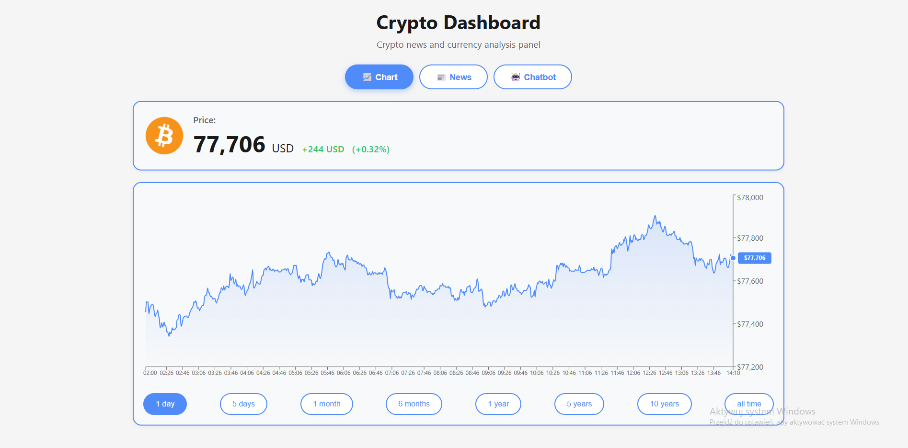
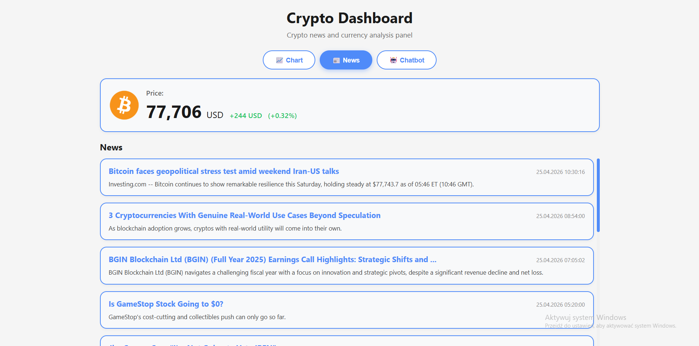
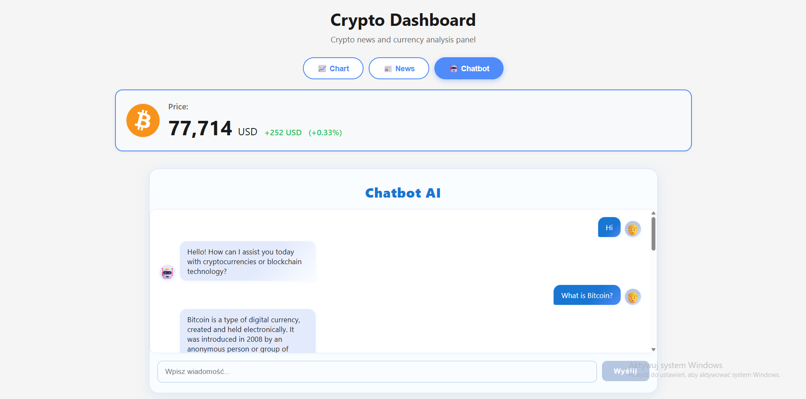

# 🪙 Crypto Dashboard

An intuitive web application for real-time Bitcoin price tracking, market trend analysis, and AI-powered cryptocurrency consultations.

---

## ✨ Features

- **Live price tracking:** Monitor Bitcoin prices in real time.
- **Market analysis:** Interactive charts showing historical price changes.
- **Latest news:** Stay up to date with the most important news from the crypto world.
- **AI Chatbot:** Intelligent assistant answering questions about the crypto market (OpenAI).

---

## 🛠️ Technology Stack

| Layer        | Technology                        |
|:------------ |:----------------------------------|
| Frontend     | React, Vite, CSS Modules          |
| Backend      | Python, FastAPI (Uvicorn)         |
| AI           | OpenAI API                        |
| Data         | Real-time Crypto APIs             |

---

## 🚀 Quick Start

### 1. Clone the repository
```bash
git clone https://github.com/michalkaluzny/crypto-dashboard.git
cd crypto-dashboard
```

### 2. Backend

In a new terminal:

```bash
cd backend
```

Install dependencies:
```bash
pip install -r requirements.txt
```

API key configuration:

Create a `.env` file in the `backend` folder and add your OpenAI key:
```env
OPENAI_API_KEY=your_actual_api_key_here
```

Run the server:
```bash
uvicorn main:app --reload
```

### 3. Frontend

In a separate terminal:

```bash
cd frontend
```

Install dependencies:
```bash
npm install
```

Start the application:
```bash
npm run dev
```

The app will be available at (by default): [http://localhost:5173](http://localhost:5173)

---

## 📸 Screenshots

- **Dashboard**
  
- **Market news**
  
- **Chatbot interface**
  

---

## 📝 License

No explicit license specified. If you want to use this project, please contact the author.

---

## 👤 Contact

Michał Kałużny – [GitHub Profile](https://github.com/michalkaluzny)
